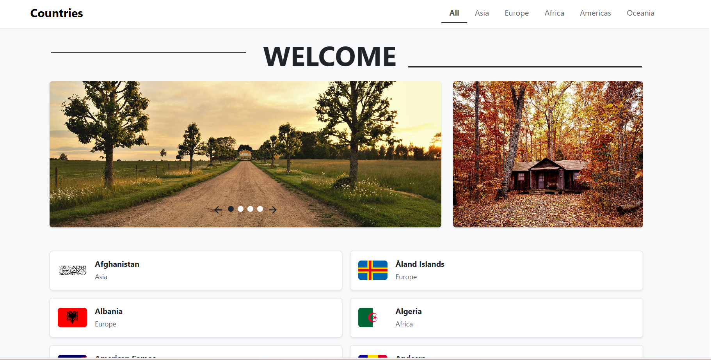
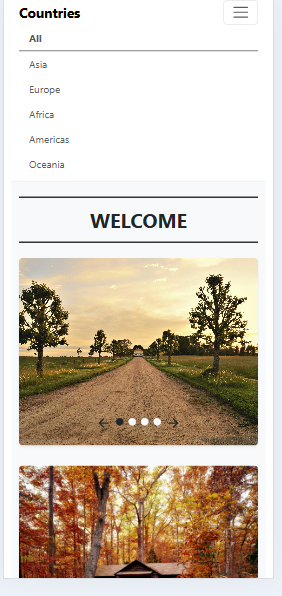
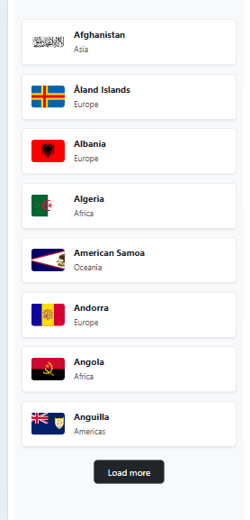

# Countries Homepage

A responsive React application that displays countries from around the world with filtering capabilities, a slider component, and pagination.

Countries Homepage 

 

 Mobile view 

 

## Features

- **Interactive Image Slider**: Carousel with next/previous navigation and dot indicators
- **Countries Listing**: Displays countries with their flags and regions
- **Continent Filtering**: Filter countries by continent (All, Asia, Europe, Africa, Americas, Oceania)
- **Load More Pagination**: Load additional countries with a button click
- **Responsive Design**: Optimized for both desktop and mobile views
- **Redux State Management**: Centralized state management with Redux Toolkit

## Technologies Used

- **React.js**: Frontend library for building user interfaces
- **Next.js**: React framework for server-side rendering and static site generation
- **Redux Toolkit**: State management library
- **React-Bootstrap**: UI component library
- **REST Countries API**: Data source for country information
- **TypeScript**: Static type checking

